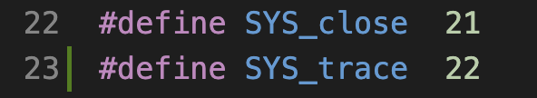
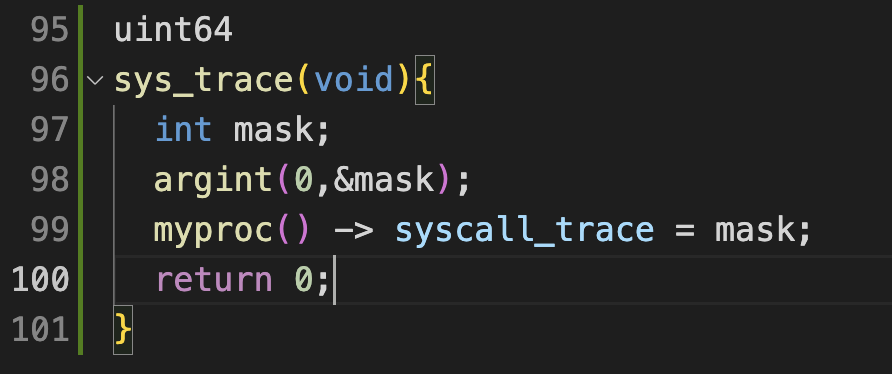
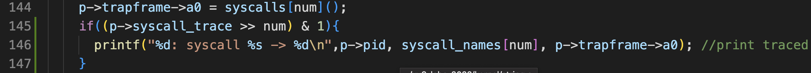
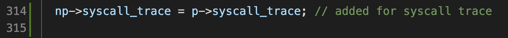
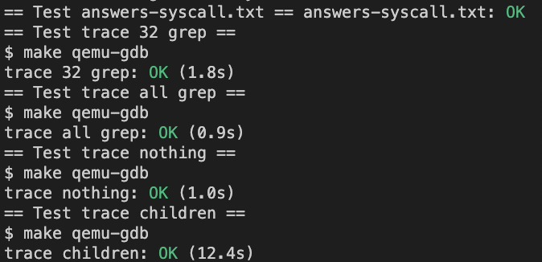

## Lab2

---
## using gdb(easy)
1. > make qemu-geb 
</img>
2. > gdb multiarch (at another window)
</img>
3. > (gdb) target remote localhost:26000 (which is given by 1)
4. > (gdb) file kernel/kernel
</img>

---
## System call tracing(moderate)
1. > Modify makefile user/user.h and user/usys.pl to use trace as application
2. > Allocate SYS_trace num at syscall.h
</img>
3. > Write sys_trace func
</img>
4. > print syscall info at syscall.c
</img>
5. > Inherit mask to forked process
</img>
</img>

---
## Sysinfo(moderate)
