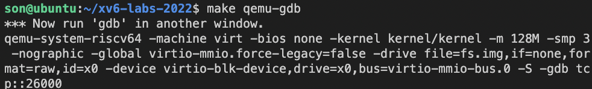
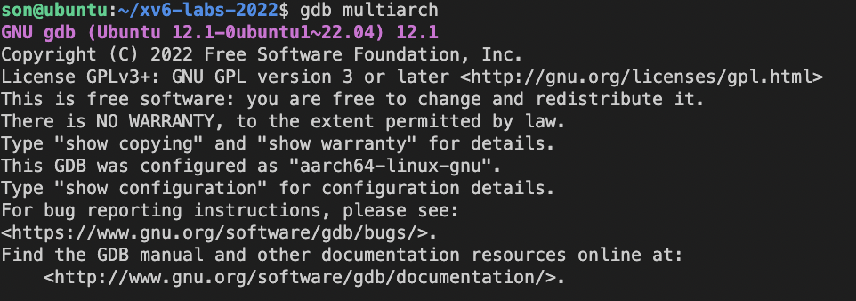
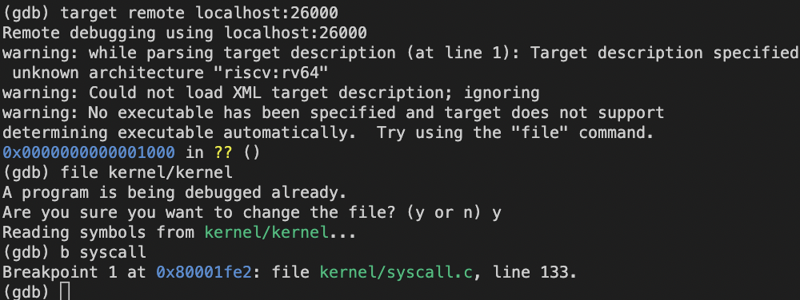

## Lab2

---
## using gdb(easy)
1. > make qemu-geb 

2. > gdb multiarch (at another window)

3. (gdb) target remote localhost:26000 (which is given by 1)
4. (gdb) file kernel/kernel

---
## System call tracing(moderate)

---
## Sysinfo(moderate)
